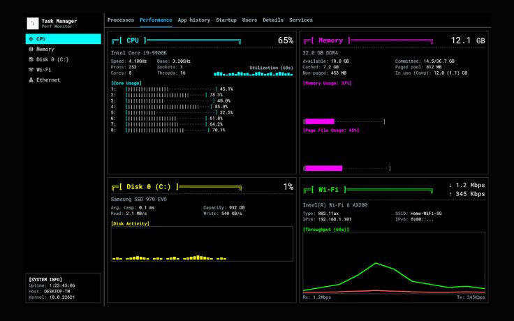

<div align="center">

# `> SPECTRE.DEV_`

### 🧑‍💻 Computer Engineering Student · Software Builder · Data Explorer


<br/>

[](https://www.python.org/)
[](https://nextjs.org/)
[](https://www.typescriptlang.org/)
[](https://git-scm.com/)

</div>

---

## 🖥️ `whoami`

```bash
spectre@engineering-lab:~$ whoami

Computer Engineering Student
Software Builder
Data Analytics Enthusiast
Embedded Systems Explorer
Problem Solver
```

I'm a Computer Engineering student exploring the intersection of:

- 💻 Software Engineering
- 📊 Data & Analytics
- ⚙️ Engineering Systems
- 🔌 Embedded Systems
- 🤖 Automation
- 🧠 Artificial Intelligence

I enjoy turning ideas into working systems — from software and APIs to engineering projects and physical computing.

---

## ⚡ `systemctl status spectre`

<div align="center">



</div>

---

## 🧰 `cat tech_stack.txt`

### 💻 Software

```text
Python          █████████████████░░░
JavaScript      ███████████████░░░░░
TypeScript      ████████████░░░░░░░░
Next.js         ████████████░░░░░░░░
SQL             ███████████░░░░░░░░░
REST APIs       ███████████░░░░░░░░░
```

### 🗄️ Backend & Data

- 🐍 Python
- 🗃️ SQLite
- 🐘 PostgreSQL
- ⚡ Supabase
- 🔌 REST APIs
- 📊 Data Analysis
- 🧮 Data Processing
- 🤖 Automation

### ⚙️ Engineering

- 🔌 Arduino
- 🔧 Electronics
- 🤖 Robotics
- 🖥️ Computer Architecture
- ⚡ Electrical & Electronic Systems
- 🛠️ Engineering Design
- 📐 SolidWorks

---

## 🚀 `~/projects`

```bash
spectre@engineering-lab:~/projects$ tree

.
├── 🎵 spectre-music-curator
├── 🎓 blueprint
├── 🧭 mentora
├── 🔌 embedded-lab
└── ⚙️ engineering-projects
```

<div align="center">


</div>

### 🎵 Spectre Music Curator

A Python-based weekly music curation system that generates fresh playlists based on user preferences.

```text
User Preferences
       ↓
Recommendation Engine
       ↓
Music API
       ↓
Playlist Generator
       ↓
Telegram Bot
```

**Focus:** Python · APIs · SQLite · Automation · Recommendation Logic

---

### 🎓 Blueprint Scholarship Matcher

A scholarship discovery and matching platform designed to help students find opportunities relevant to their academic profile.

```text
Student Profile
      ↓
Scholarship Data
      ↓
Eligibility Filtering
      ↓
Matching Logic
      ↓
Scholarship Recommendations
```

**Focus:** Next.js · TypeScript · Supabase · Authentication · Databases

---

## 📚 `currently_learning`

```bash
spectre@engineering-lab:~$ ./learning.sh

[01] Python & Backend Engineering
[02] Data Analytics
[03] SQL & Database Systems
[04] Embedded Systems
[05] Computer Architecture
[06] Engineering Design
[07] APIs & System Integration
[08] AI / Machine Learning
```

> The goal isn't to collect technologies.
>
> The goal is to understand systems deeply enough to build with them.

---

## 🧠 `engineering_philosophy`

```text
        BUILD
          ↓
       OBSERVE
          ↓
      UNDERSTAND
          ↓
        DEBUG
          ↓
       IMPROVE
          ↓
        BUILD
          ↺
```

### Principles

- 🔹 Understand before abstracting
- 🔹 Build before over-engineering
- 🔹 Debug before blaming the tools
- 🔹 Document what matters
- 🔹 Learn from failed experiments
- 🔹 Keep improving

---

## 🎯 `roadmap`

```text
2026
│
├── 📚 Strengthen Computer Engineering fundamentals
├── 🐍 Become stronger with Python
├── 📊 Build real Data Analytics projects
├── 🔌 Build practical embedded systems
├── 🌐 Improve backend & full-stack engineering
├── 🤖 Explore AI / Machine Learning
└── 🚀 Build projects that solve real problems
```

---

## 📈 `learning_by_building`

I believe the best way to understand technology is to build with it.

```text
        LEARN
          ↓
        BUILD
          ↓
        BREAK
          ↓
        DEBUG
          ↓
      UNDERSTAND
          ↓
       REBUILD
          ↓
      DOCUMENT
```

---

## 🛠️ `tools`

```text
Editor       → VS Code
Versioning   → Git / GitHub
Frontend     → Next.js / TypeScript
Backend      → Python / APIs / Supabase
Database     → PostgreSQL / SQLite
Engineering  → Arduino / Electronics
Design       → SolidWorks
```

---

## 📊 `github.stats`

<div align="center">


</div>

---

## 🛰️ `terminal`

```text
┌──────────────────────────────────────────────────────────────┐
│ spectre@engineering-lab                                     │
│                                                              │
│ $ git status                                                 │
│                                                              │
│ On branch main                                               │
│                                                              │
│ Changes to be committed:                                    │
│                                                              │
│   modified:   knowledge                                     │
│   modified:   experience                                    │
│   modified:   engineering                                   │
│                                                              │
│ $ git commit -m "keep building"                              │
│                                                              │
│ [main] keep building                                         │
│                                                              │
└──────────────────────────────────────────────────────────────┘
```

---

## 🌐 `connect`

```bash
spectre@engineering-lab:~$ ./connect.sh
```

<div align="center">

[](https://github.com/spectredev25-star/SPECTRE)

[](https://www.linkedin.com/in/spectre-dev-1a42a5417/)


---

### ⚙️ BUILDING IN PUBLIC

```text
Code is the implementation.
Engineering is the understanding.
```

**`< / >` · `⚙️` · `📊` · `🔌`**

<br/>

```text
┌──────────────────────────────────────────┐
│                                          │
│  SPECTRE.DEV                             │
│  SYSTEM STATUS: ONLINE                   │
│                                          │
│  [ BUILD ] [ LEARN ] [ DEBUG ] [ REPEAT ]│
│                                          │
└──────────────────────────────────────────┘
```

</div>
